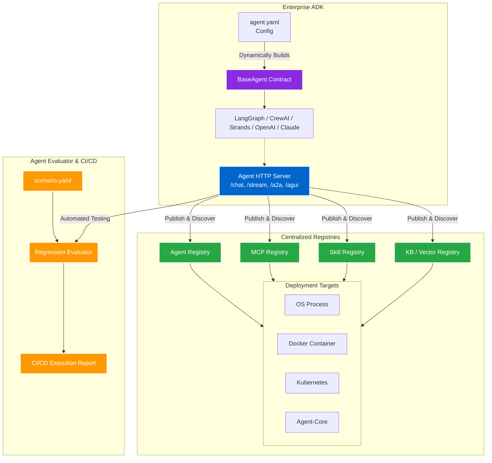

## Impact
Standardized | Multi-Framework AI (LangGraph, CrewAI, Strands)
Automated | Agent Evaluation in CI/CD
Centralized | Component Registries (Agents, MCP, Skills)

## Overview
As generative AI exploded across the enterprise, teams began building AI agents using disconnected, one-off scripts. There was no standard contract for how an agent should expose its tools, enforce guardrails, or return structured output. This wild-west approach made it nearly impossible to integrate agents into centralized platforms or share capabilities across business units.

## The Problem
If a team added a new guardrail or an awesome new tool to their agent, it was trapped in their specific repository. Worse, because LLM outputs are non-deterministic, DevOps teams were completely unable to run reliable regression testing on these agents during CI/CD deployments. 

### Challenge 1: Fragmented Agent Frameworks
**Issue:** Teams were using a mix of LangGraph, CrewAI, AWS Strands, OpenAI, and Claude. The lack of a common interface meant integrating an agent into an internal UI or another service required custom, bespoke API contracts every single time.
**Solution:** I designed the Enterprise Agent Development Kit (ADK). I created a strict `BaseAgent` class that established a standard contract for tools, Model Context Protocol (MCP), and guardrails. Framework-specific classes (e.g., `LangGraphAgent`, `CrewAIAgent`) inherited from this base. I then bundled an **Agent HTTP Server** that automatically exposed these agents via universal endpoints (`/chat`, `/stream`, `/a2a`, `/agui`), making front-end integration completely agnostic to the underlying AI framework.

### Challenge 2: Testing & Component Discovery
**Issue:** Teams couldn't easily discover tools built by others, and they had no way to formally test their agents in the CI/CD pipeline to ensure quality didn't degrade after a prompt tweak.
**Solution:** I built the **Agent Evaluator**, a testing framework where developers define LLM regression scenarios in a `scenario.yaml` file. The evaluator automatically tests the agent's output against expected behavior and generates a CI/CD-compatible report. Finally, I built central **ADK Registries** (Agent Registry, MCP Registry, Skill Registry, KB Registry). The ADK natively hooks into these, allowing teams to instantly publish their agents and vector knowledge bases, making them discoverable and usable enterprise-wide.

### Challenge 3: Agent Configuration & Deployment at Scale
**Issue:** Modifying an agent's tools, MCPs, or guardrails required code changes, testing, and a full software deployment cycle. Furthermore, there was no standard way to host the agents once they were built.
**Solution:** I implemented a declarative approach where the entire agent—including its tools, MCP integrations, sub-agents, guardrails, and structured output formats—can be defined in a single `agent.yaml` file. The ADK parses this YAML and dynamically constructs the agent on the fly. This made deployments trivial, as enhancing an agent only required updating the YAML file. Furthermore, the ADK supports multiple deployment targets out-of-the-box, allowing teams to run their agents as an OS Process, a Docker Container, on Kubernetes, or via Agent-Core.

### Architecture

## Business Outcomes
- **Universal Interoperability:** Front-end platforms can now consume any agent—whether it's built on LangGraph or CrewAI—using a single, unified protocol.
- **Enterprise Reusability:** The Skill and MCP registries prevented massive duplication of effort; a tool built by the data team can now be instantly utilized by an agent built by the DevOps team.
- **Infrastructure as Data:** By defining agents entirely in `agent.yaml`, teams can update prompts, swap out models, or add new MCP tools without writing a single line of Python, accelerating time-to-market.
- **Reliable AI Deployments:** The Agent Evaluator enabled strict regression testing in the pipeline, ensuring that prompt adjustments or model upgrades did not break expected business logic.
