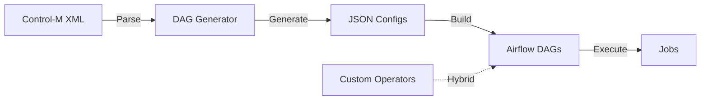

## Impact
2w → 3d | Release Cycle  
1000+ | Jobs Migrated  
85% | Automation  
100% | Uptime (Hybrid)

## Overview
Migrated **100+ workflows** (1000+ interdependent jobs) from legacy Control-M to Apache Airflow. Built a configuration-driven DAG generator and custom operators to enable phased migration without downtime. Reduced release cycles from 2 weeks to 3 days while maintaining hybrid execution during transition.

## The Problem

### Scale
- **100 workflows** with **1000+ interdependent jobs**
- Control-M jobs in proprietary syntax with no version control
- Complex dependencies across multiple teams

### Challenge 1: Unmaintainable DAG Files
**Issue:** Writing individual DAG files for each workflow would be tedious and error-prone. Maintenance nightmare if Control-M jobs change during migration.
**Solution:** Built Python DAG generator converting Control-M XML to JSON configs. 85% automation for DAG creation.

### Challenge 2: Phased Migration Risk
**Issue:** Migration happened in phases. Migrated Airflow DAGs might depend on un-migrated Control-M workflows. Risk of breaking existing dataflows.
**Solution:** Built hybrid operators: ControlM Polling Sensor and ControlM Trigger Operator for seamless cross-system execution.

### Challenge 3: Missing Operators
**Issue:** Airflow lacked native Control-M polling, SSH operations, and ServiceNow integration.
**Solution:** Built 5 custom operators: ControlM Poll/Trigger, SSH Sensor/Operator, ServiceNow Hook. Reusable across projects.

## Solution: DAG Generator & Custom Operators

### Configuration-Driven Approach
Built a Python DAG Generator that converts Control-M XML to JSON configs. Benefits:

- Control-M changes? Re-run generator—automatically picks up changes
- 85% reduction in manual DAG writing work
- All configs stored in Git with full audit trail
- Easy to review and validate migrations

```json
{
    "name": "DataFlow",
    "nodes": [
        {
            "name": "job1",
            "_type": "ssh_sensor.SSHSensorAsync",
            "parameters": {
            }
        },
        {
            "name": "job2",
            "_type": "ssh_sensor.SSHSensorAsync",
            "parameters": {
            }
        },
        {
             "name": "job3",
             "_type": "ssh_sensor.SSHSensorAsync",
             "parameters": {
             }
        },
        {
            "name": "job4",
            "_type": "controlm_polling_sensor.ControlMPollingSensorAsync",
            "parameters": {
            }
        }
    ],
    "connections": {
        "job1": [
            "job2", 
            "job3"
        ],
        "job2": [
            "job3"
        ],
        "job4": [
            "job3"
        ]
    },
    "schedule": "0 5 * * *"
}

```

### Migration Flow Architecture



### Custom Operators Built
| Operator | Description |
|---|---|
| **ControlM Polling Sensor** | Polls Control-M API for job completion. Allows Airflow DAGs to depend on Control-M workflows. |
| **ControlM Trigger Operator** | Triggers Control-M workflows from Airflow. Enables reverse dependencies during transition. |
| **SSH Sensor/Operator** | Execute and monitor remote jobs via SSH. Integrates legacy Unix-based systems. |
| **ServiceNow Hook** | Creates incidents automatically on job failures. Integrated incident management. |

## Results & Impact
14x → Faster Releases
1000+ → Jobs Running
100% → Uptime (Hybrid)
85% → Automation Rate

### Business Outcomes
- **⚡ Faster Deployments:** Job changes deployed in hours vs. weeks, enabling agile data pipeline updates
- **🔍 Better Debugging:** Full visibility into dependencies and execution history with Git audit trail
- **👥 Team Empowerment:** Engineers could modify and deploy their own DAGs without ops overhead
- **📈 Scalability:** Kubernetes auto-scaling handled peak loads during phased migration

### Technical Outcomes
- **📊 1000+ Jobs Migrated:** All running on Airflow with 99.5% uptime
- **🔐 Git Audit Trail:** Complete version control for all DAG configs
- **🔄 Hybrid Mode:** Airflow and Control-M worked together seamlessly during 6-month transition
- **⏱️ 15 Min Triage:** Reduced from 2 hours with integrated alerting

## Key Learnings
- **Configuration-Driven > Hand-Coded:** A reusable generator beats writing 100 DAGs by hand
- **Build for Hybrid Transitions:** Support both systems during migration—no risky big-bang rewrites
- **Operators as Platforms:** 5 custom operators became foundation for 100+ DAGs and future projects
- **Phase Gradually:** Small incremental migrations reduce risk and allow course correction

## Architect Reflection
This project taught me the power of abstraction and configuration-driven design. Rather than hand-coding 100 DAGs, we built a generator and operator platform that enabled the entire migration.

Most importantly, supporting hybrid mode proved that thoughtful architecture enables gradual modernization without risky big-bang rewrites. This approach has since been applied to other legacy system migrations at the company.
