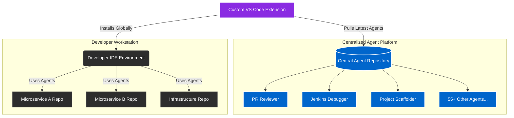

## Impact
58 | Specialized Agents Built
0 | Duplicate Agent Code
300% | Increase in AI Adoption

## Overview
When the organization introduced GitHub Copilot, adoption remained critically low. Developers struggled with inconsistent outputs and a lack of proper training on prompt engineering. To solve this, I was tasked with increasing AI adoption in a user-friendly, highly scalable manner across the entire business unit.

## The Problem
The few teams that *did* adopt AI started building their own custom agents. Unfortunately, they were hardcoding and copying these agents directly into their individual project repositories. If a team owned 10 microservices, they had 10 duplicated copies of the same agent. Any bug fix or enhancement meant manually updating every single repository—a maintenance nightmare.

### Challenge 1: Low Adoption and Inconsistent Output
**Issue:** Developers were not using Copilot effectively because writing prompts for complex enterprise tasks (like debugging Jenkins pipelines or scaffolding internal frameworks) yielded inconsistent and unreliable results.

**Solution:** I designed and implemented 58 highly specialized Copilot agents tailored to specific engineering workflows. These included a Bitbucket Agent, PR Review Agent, Jenkins Debugger, Project Scaffolder, Code Scanners, and a Release Orchestrator. By embedding expert context into the agents, developers received high-quality, predictable outputs without needing to be prompt engineers.

### Challenge 2: Duplicate Agents and Maintenance Overhead
**Issue:** Teams were copying agent code into every project repository. Enhancing an agent required a massive, cross-repository refactoring effort, leading to version drift and fragmented capabilities.

**Solution:** I centralized the agent logic and developed a custom Visual Studio Code Extension to distribute them. Instead of copying code into their repos, developers simply install the extension once. All 58 agents become instantly available globally across all their local projects, ensuring everyone is always using the latest, centralized version of the AI tools.

### Architecture

## Core AI Agents Developed
Out of the 58 agents deployed, here are some of the highest-impact workflows:

- **Refactor + PR Review Chain:** Chained agents that automatically refactor complex modules against clean-code guidelines and pre-review them before a PR is even opened. This measurably reduced review turnaround times.
- **Spark Optimizer:** Reviews PySpark and Scala Spark pipelines before promotion to prod. It flags anti-patterns and suggests concrete rewrites, cutting runtime on high-volume digital-processing jobs by ~40%.
- **Jenkins Debugger:** When a build fails, this agent automatically fetches and classifies logs, test results, and artifacts, cutting build triage from tens of minutes to a couple of minutes.
- **Data Lineage Tracer:** Runs against Glue jobs and PySpark pipelines to automatically produce Mermaid lineage diagrams from source to sink, solving massive data governance auditing bottlenecks.
- **Data Pipeline Generator:** Automatically scaffolds AWS Glue jobs, PySpark scripts, and Airflow DAGs with standard S3 I/O, logging, and error handling, completely removing initial boilerplate.
- **Commit Workflow Orchestrator:** Summarizes code diffs, proposes standard commit messages, and commits with confirmation, ensuring pristine and auditable Git histories.

## Business Outcomes
- **Massive Adoption Spike:** By removing the friction of prompt engineering and providing out-of-the-box, enterprise-specific tools, Copilot adoption skyrocketed across the business unit.
- **Zero Duplication:** The VS Code Extension entirely eliminated the need to duplicate agent configurations across hundreds of repositories.
- **Centralized Governance:** Agent enhancements, security patches, and new features are now pushed centrally to the extension, instantly upgrading the capabilities of every developer.
