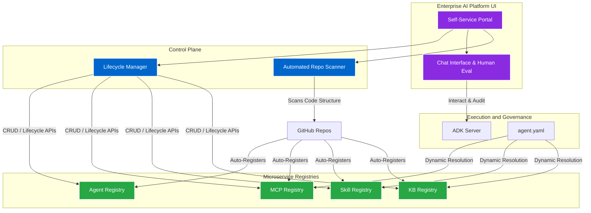

## Impact
Automated | Repo Scanning & Component Registration
Centralized | UI for Discovery & Lifecycle Governance
Governed | Chat History & Human-in-the-Loop Evaluation

## Overview
While the **Agent Development Kit (ADK)** provided the foundational code contract and execution engine, the enterprise needed a centralized "Control Plane" where teams could visually discover, test, and manage the lifecycle of these AI components. I engineered the overarching Enterprise AI Platform to serve as the unified hub for all AI initiatives across the business unit.

## The Problem

### Challenge 1: Component Discovery & Registry Governance
**Issue:** Teams were building powerful agents and MCP servers, but had no unified graphical hub to share them, explore their capabilities, or govern their deployment lifecycle across environments.

**Solution:** I architected the Enterprise AI Platform UI. The registries (Agent, MCP, Skill, KB) run as standalone microservices exposing REST APIs (`/register`, `/update`, `/delete`, `/lifecycle`). I built a self-service UI where authorized users can browse available components, understand their capabilities, and manage their full lifecycle from development to production.

### Challenge 2: Automated Onboarding at Scale
**Issue:** Manually registering dozens of individual agents, skills, and tools into the registry via API was a friction point that slowed down platform adoption.

**Solution:** I engineered an automated GitHub repository scanner. Users simply provide their repository URL in the UI. The platform automatically scans the codebase, identifies components based on their adherence to the ADK contract (e.g., classifying a repository as an MCP server vs. an ADK agent), and automatically registers them in the appropriate underlying microservice registry.

### Challenge 3: Observability, Interaction, and Dynamic Loading
**Issue:** Developers and auditors needed a way to interact with running agents, view past chat histories, and evaluate the quality of LLM responses. Furthermore, agents needed a way to dynamically pull dependencies.

**Solution:** The platform UI integrates directly with the ADK HTTP Server, providing a universal chat interface where users can interact with any registered agent. It natively displays chat histories and runs agent response evaluations directly in the UI, providing the critical "human-in-the-loop" feedback necessary for compliance and governance. Additionally, users can now dynamically reference registered components (like an MCP tool) directly in their declarative `agent.yaml` files, and the ADK will seamlessly fetch and execute them at runtime via the platform.

## Architecture

- **Self-Service Portal:** The unified frontend for interacting with agents and managing lifecycle states.
- **Automated Repo Scanner:** A service that ingests GitHub URLs, parses code structure, and automates component registration.
- **Microservice Registries:** Decoupled backing services (Agent, MCP, Skill, KB) that store component metadata and state.
- **Agent Evaluator UI:** The interface for human-in-the-loop response evaluation and chat history auditing.

## Business Outcomes
- **Frictionless Adoption:** Automated repo scanning reduced the time to publish an agent or MCP server to the enterprise from hours to seconds.
- **Audit-Ready AI:** Centralized chat history and integrated response evaluation provided compliance and operations teams with the exact governance trail they required.
- **Composable AI:** The ability to dynamically reference registered tools within `agent.yaml` created a highly composable ecosystem where complex agents can be assembled entirely from pre-existing, community-built blocks.
