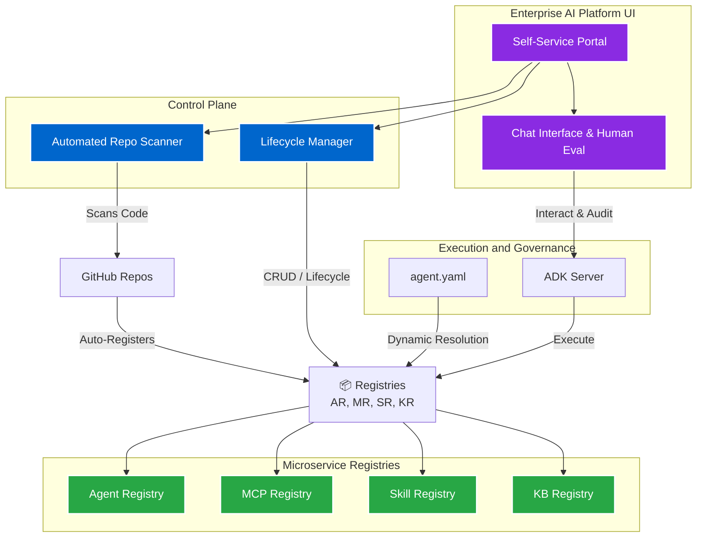
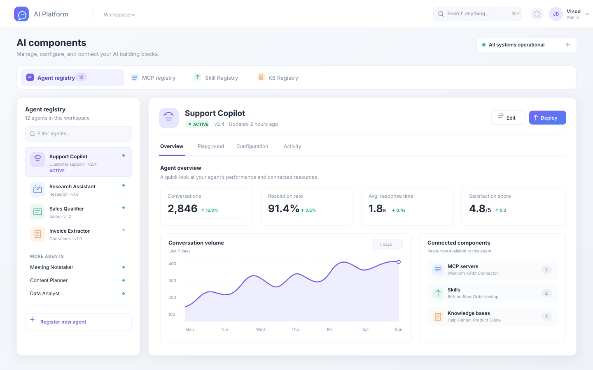

## Impact
Automated | Repo Scanning & Component Registration
Centralized | UI for Discovery & Lifecycle Governance
Governed | Chat History & Human-in-the-Loop Evaluation

## Overview
While the **Agent Development Kit (ADK)** provided the foundational code contract and execution engine, the enterprise needed a centralized "Control Plane" where teams could visually discover, test, and manage the lifecycle of these AI components. I engineered the overarching Enterprise AI Platform to serve as the unified hub for all AI initiatives across the business unit.

## The Problem

### Challenge 1: Component Discovery & Registry Governance
**Issue:** Teams were building powerful agents and MCP servers, but had no unified graphical hub to share them, explore their capabilities, or govern their deployment lifecycle across environments.

**Solution:** I architected the Enterprise AI Platform UI. The registries (Agent, MCP, Skill, KB) run as standalone microservices exposing REST APIs (`/register`, `/update`, `/delete`, `/lifecycle`). I built a self-service UI where authorized users can browse available components, understand their capabilities, and manage their full lifecycle from development to production.

### Challenge 2: Automated Onboarding at Scale
**Issue:** Manually registering dozens of individual agents, skills, and tools into the registry via API was a friction point that slowed down platform adoption.

**Solution:** I engineered an automated GitHub repository scanner. Users simply provide their repository URL in the UI. The platform automatically scans the codebase, identifies components based on their adherence to the ADK contract (e.g., classifying a repository as an MCP server vs. an ADK agent), and automatically registers them in the appropriate underlying microservice registry.

### Challenge 3: Observability, Interaction, and Dynamic Loading
**Issue:** Developers and auditors needed a way to interact with running agents, view past chat histories, and evaluate the quality of LLM responses. Furthermore, agents needed a way to dynamically pull dependencies.

**Solution:** The platform UI integrates directly with the ADK HTTP Server, providing a universal chat interface where users can interact with any registered agent. It natively displays chat histories and runs agent response evaluations directly in the UI, providing the critical "human-in-the-loop" feedback necessary for compliance and governance. Additionally, users can now dynamically reference registered components (like an MCP tool) directly in their declarative `agent.yaml` files, and the ADK will seamlessly fetch and execute them at runtime via the platform.

## Architecture

- **Self-Service Portal:** The unified frontend for interacting with agents and managing lifecycle states.
- **Automated Repo Scanner:** A service that ingests GitHub URLs, parses code structure, and automates component registration.
- **Microservice Registries:** Decoupled backing services (Agent, MCP, Skill, KB) that store component metadata and state.
- **Agent Evaluator UI:** The interface for human-in-the-loop response evaluation and chat history auditing.

## Sample UI Images

## Live Registry Explorer

  

  

    <button class="registry-tab-btn active" onclick="switchRegistry(event, 'agents')">🤖 Agents</button>
    <button class="registry-tab-btn" onclick="switchRegistry(event, 'mcps')">🔧 MCP Servers</button>
    <button class="registry-tab-btn" onclick="switchRegistry(event, 'skills')">⚡ Skills</button>
    <button class="registry-tab-btn" onclick="switchRegistry(event, 'kbs')">📚 Knowledge Bases</button>
    <button class="registry-tab-btn" onclick="switchRegistry(event, 'dashboard')">📊 Dashboard</button>
  

  <!-- Agents Tab -->
  

    

      
Customer Support

      
Code Review

      
Data Analysis

      
Email Responder

    

    

      

        

          
Customer Support Agent

          
Prod

        

        

          
Description

          
Handles customer inquiries with multi-turn conversation support

        

        

          
Dependencies

          
Slack Notification Server, Email Parsing Skill

        

        

          
Status

          
✅ Active (Uptime: 99.8%)

        

        

          
Test Query

          <input type="text" class="interaction-input" placeholder="Enter a customer query...">
          <button class="interaction-btn">Send</button>
        

      

      

        

          
Code Review Agent

          
Prod

        

        

          
Description

          
Analyzes code for quality, security, and best practices

        

        

          
Dependencies

          
GitHub Integration MCP, SQL Query MCP

        

        

          
Status

          
✅ Active (Uptime: 99.9%)

        

        

          
Test Query

          <input type="text" class="interaction-input" placeholder="Enter a GitHub repo URL...">
          <button class="interaction-btn">Analyze</button>
        

      

      

        

          
Data Analysis Agent

          
Staging

        

        

          
Description

          
Processes data queries and generates insights with visualizations

        

        

          
Dependencies

          
SQL Query MCP, Cloud Storage MCP

        

        

          
Status

          
⚠️ Staging (Ready for testing)

        

        

          
Test Query

          <input type="text" class="interaction-input" placeholder="Enter SQL query...">
          <button class="interaction-btn">Execute</button>
        

      

      

        

          
Email Responder

          
Dev

        

        

          
Description

          
Drafts and sends intelligent email responses with context awareness

        

        

          
Dependencies

          
Email Parsing Skill, Sentiment Analysis

        

        

          
Status

          
🔧 Dev (In development)

        

        

          
Test Query

          <input type="text" class="interaction-input" placeholder="Enter email content...">
          <button class="interaction-btn">Draft Response</button>
        

      

    

  

  <!-- MCP Servers Tab -->
  

    

      
GitHub Integration

      
Slack Notifications

      
SQL Query

      
Cloud Storage

    

    

      

        

          
GitHub Integration MCP

          
Prod

        

        

          
Endpoints

          
read_repo | list_issues | create_pr | update_status

        

        

          
Used By

          
Code Review Agent, Data Analysis Agent

        

        

          
Test Call

          <input type="text" class="interaction-input" placeholder="e.g., owner/repo">
          <button class="interaction-btn">Call Endpoint</button>
        

      

      

        

          
Slack Notification Server

          
Prod

        

        

          
Endpoints

          
send_message | post_thread | add_reaction | update_status

        

        

          
Used By

          
Customer Support Agent, Email Responder

        

        

          
Test Call

          <input type="text" class="interaction-input" placeholder="Enter message...">
          <button class="interaction-btn">Send Test</button>
        

      

      

        

          
SQL Query MCP

          
Prod

        

        

          
Endpoints

          
execute_query | describe_schema | get_stats | validate_query

        

        

          
Used By

          
Data Analysis Agent, Code Review Agent

        

        

          
Test Call

          <input type="text" class="interaction-input" placeholder="SELECT * FROM...">
          <button class="interaction-btn">Execute</button>
        

      

      

        

          
Cloud Storage MCP

          
Staging

        

        

          
Endpoints

          
upload_file | download_file | list_objects | delete_object

        

        

          
Used By

          
Data Analysis Agent (Staging)

        

        

          
Test Call

          <input type="text" class="interaction-input" placeholder="Enter file path...">
          <button class="interaction-btn">Upload</button>
        

      

    

  

  <!-- Skills Tab -->
  

    

      
Email Parsing

      
Sentiment Analysis

      
Doc Summarizer

      
Code Generator

    

    

      

        

          
Email Parsing Skill

          
v1.2

        

        

          
Description

          
Extracts sender, recipient, subject, body, and attachments from emails

        

        

          
Used By

          
Customer Support Agent, Email Responder

        

        

          
Test Input

          <input type="text" class="interaction-input" placeholder="Paste email content...">
          <button class="interaction-btn">Parse</button>
        

      

      

        

          
Sentiment Analysis

          
v2.0

        

        

          
Description

          
Analyzes text sentiment with confidence scoring (positive, negative, neutral)

        

        

          
Used By

          
Customer Support Agent

        

        

          
Test Input

          <input type="text" class="interaction-input" placeholder="Enter text to analyze...">
          <button class="interaction-btn">Analyze</button>
        

      

      

        

          
Document Summarizer

          
v1.5

        

        

          
Description

          
Generates concise summaries from long-form documents

        

        

          
Used By

          
Data Analysis Agent, Code Review Agent

        

        

          
Test Input

          <input type="text" class="interaction-input" placeholder="Paste document...">
          <button class="interaction-btn">Summarize</button>
        

      

      

        

          
Code Generator

          
v3.1

        

        

          
Description

          
Generates code snippets based on natural language specifications

        

        

          
Used By

          
Code Review Agent (Coming soon)

        

        

          
Test Input

          <input type="text" class="interaction-input" placeholder="Describe what you want to code...">
          <button class="interaction-btn">Generate</button>
        

      

    

  

  <!-- Knowledge Bases Tab -->
  

    

      
Product Docs

      
API Reference

      
Internal Policies

      
Compliance

    

    

      

        

          
Product Documentation

          
2.3K docs

        

        

          
Content

          
User guides, feature documentation, troubleshooting guides

        

        

          
Used By

          
Customer Support Agent, Data Analysis Agent

        

        

          
Search

          <input type="text" class="interaction-input" placeholder="Search documentation...">
          <button class="interaction-btn">Search</button>
        

      

      

        

          
API Reference

          
450 endpoints

        

        

          
Content

          
API specifications, endpoint documentation, authentication guides

        

        

          
Used By

          
Code Review Agent, Data Analysis Agent

        

        

          
Search

          <input type="text" class="interaction-input" placeholder="Search API endpoints...">
          <button class="interaction-btn">Search</button>
        

      

      

        

          
Internal Policies

          
128 docs

        

        

          
Content

          
Company policies, procedures, guidelines, and best practices

        

        

          
Used By

          
Email Responder, Customer Support Agent

        

        

          
Search

          <input type="text" class="interaction-input" placeholder="Search policies...">
          <button class="interaction-btn">Search</button>
        

      

      

        

          
Compliance Guide

          
89 docs

        

        

          
Content

          
Data protection, security standards, audit trails, GDPR compliance

        

        

          
Used By

          
All agents for governance

        

        

          
Search

          <input type="text" class="interaction-input" placeholder="Search compliance docs...">
          <button class="interaction-btn">Search</button>
        

      

    

  

  

    

🤖

4

Active Agents

    

🔧

4

MCP Servers

    

⚡

4

Skills

    

📚

4

Knowledge Bases

    

✅

3,850

Total Interactions

    

⭐

4.7/5

Avg. Satisfaction

  

  

    
📊 Registry Breakdown

    

      

🤖 Agents

4

3 Prod | 1 Dev

      

🔧 MCP Servers

4

3 Prod | 1 Staging

      

⚡ Skills

4

Avg Version: 2.2

      

📚 Knowledge Bases

3.1K

Total Documents

    

  

  

    
📈 Utilization Metrics

    

      

Agent Requests (24h)

1,240

↑ 12% vs yesterday

      

API Calls (24h)

8,750

↑ 8% vs yesterday

      

Avg Response Time

240ms

Within SLA ✅

      

System Uptime

99.9%

This Month

    

  

  

    
🎯 Quality Metrics

    

      

Agent Accuracy

92%

Avg across all agents

      

Error Rate

0.8%

Below threshold

      

User Satisfaction

4.7/5

Based on 520 reviews

      

Completion Rate

96%

Tasks completed

    

  

  

## Business Outcomes
- **Frictionless Adoption:** Automated repo scanning reduced the time to publish an agent or MCP server to the enterprise from hours to seconds.
- **Audit-Ready AI:** Centralized chat history and integrated response evaluation provided compliance and operations teams with the exact governance trail they required.
- **Composable AI:** The ability to dynamically reference registered tools within `agent.yaml` created a highly composable ecosystem where complex agents can be assembled entirely from pre-existing, community-built blocks.
