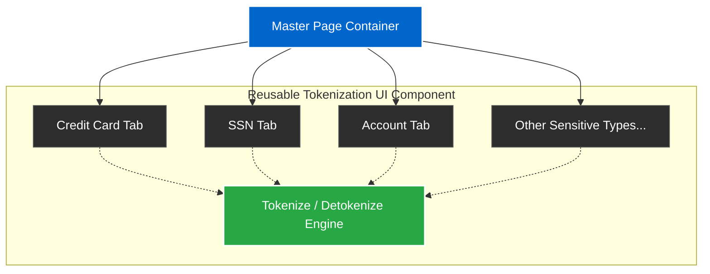

## Impact
1 Component | Reusable Architecture
100% | Design Consistency
0 | Code Changes for New Types

## Overview
My first professional project in 2007 was building an Enterprise Tokenization UI in ASP.NET. The client had tokenized warehouse tables to protect sensitive data but lacked a user interface for business analysts to safely tokenize or detokenize the information when needed.

## The Problem
There were multiple sensitive data types (such as Credit Card, SSN, Checking Account, etc.). The initial approach suggested building a separate page for each sensitive type, which would result in a bloated codebase, inconsistent UI, and significant maintenance overhead whenever a new data type was added.

### Challenge 1: Scalability of UI for Sensitive Types

**Issue:** Building individual pages for each of the multiple sensitive types (Credit, SSN, Checking Account, etc.) would be inefficient and hard to maintain.

**Solution:** Instead of building one page for each sensitive type, I built a single reusable component where I just needed to pass the sensitive data type as a parameter.

### UI Architecture

## Business Outcomes
- **Consistent Design:** The reusable component provided a unified, consistent experience across all data types.
- **Simplified Architecture:** Reduced the codebase size and complexity significantly.
- **Future-Proof:** Enabled the addition of new sensitive data types instantly without requiring any code changes.
