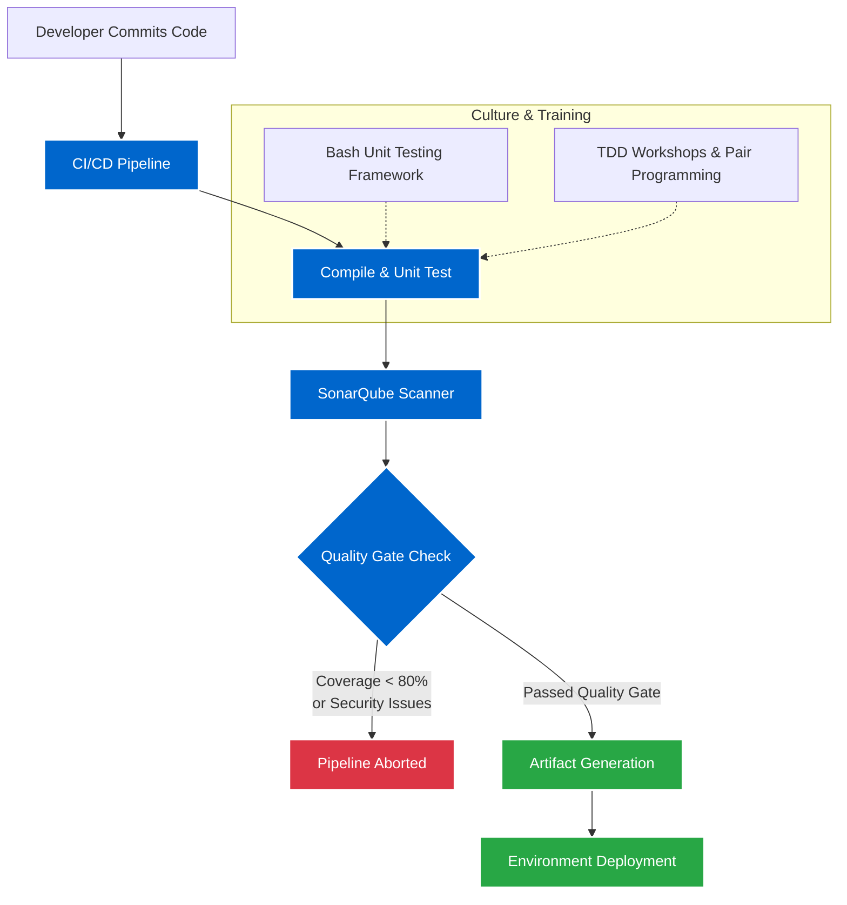

## Impact
100% | Business Unit Adoption
>80% | Code Coverage Enforced
Zero | Untested Deployments

## Overview
As the organization matured its CI/CD practices, a critical gap remained: code quality. Existing pipelines simply deployed whatever code was committed, completely skipping static analysis and security scanning. Consequently, automated unit testing was virtually zero across the application teams, resulting in fragile releases and high technical debt.

## The Problem
You cannot suddenly turn on strict quality gates for teams that have never written a unit test—doing so would block all deployments and halt the business. We needed a technical mechanism to enforce quality, paired with a massive cultural shift and training effort to help teams meet those new standards.

### Challenge 1: Enforcing Quality Without Halting Development
**Issue:** Pipelines allowed teams to deploy code with critical vulnerabilities, bugs, and zero test coverage.

**Solution:** I implemented a hard-gated pipeline architecture using SonarQube. If a scan failed or if code coverage dropped below the strict 80% threshold, the pipeline automatically aborted the deployment. To prevent bringing development to a halt, I rolled this out in a phased manner—initially running in "audit-only" mode to show teams their baseline, then progressively shifting to hard enforcement.

### Challenge 2: Cultivating a Testing Culture
**Issue:** Application teams did not know how to write comprehensive unit tests, resolve complex SonarQube code smells, or test legacy Bash scripts.

**Solution:** I led a massive cultural transformation by conducting hands-on workshops across multiple teams. I taught them how to write unit tests, mock dependencies, and fix security hotspots. Crucially, I introduced Bash unit testing frameworks (e.g., Bats) to the organization to cover our massive footprint of shell scripts. By the end of the year, every single application team in my BU had fully implemented automated unit testing and passed the 80% SonarQube gate.

### Architecture

## Business Outcomes
- **Massive Quality Increase:** Taking unit test coverage from near zero to over 80% across an entire business unit drastically reduced production bugs and deployment rollbacks.
- **Cultural Transformation:** Developers shifted from seeing testing as an "afterthought" to making it a core part of their daily workflow, supported by the new Bash testing frameworks I introduced.
- **Automated Security:** SonarQube gates ensured that no critical vulnerabilities or massive code smells could ever reach the production environment again.
