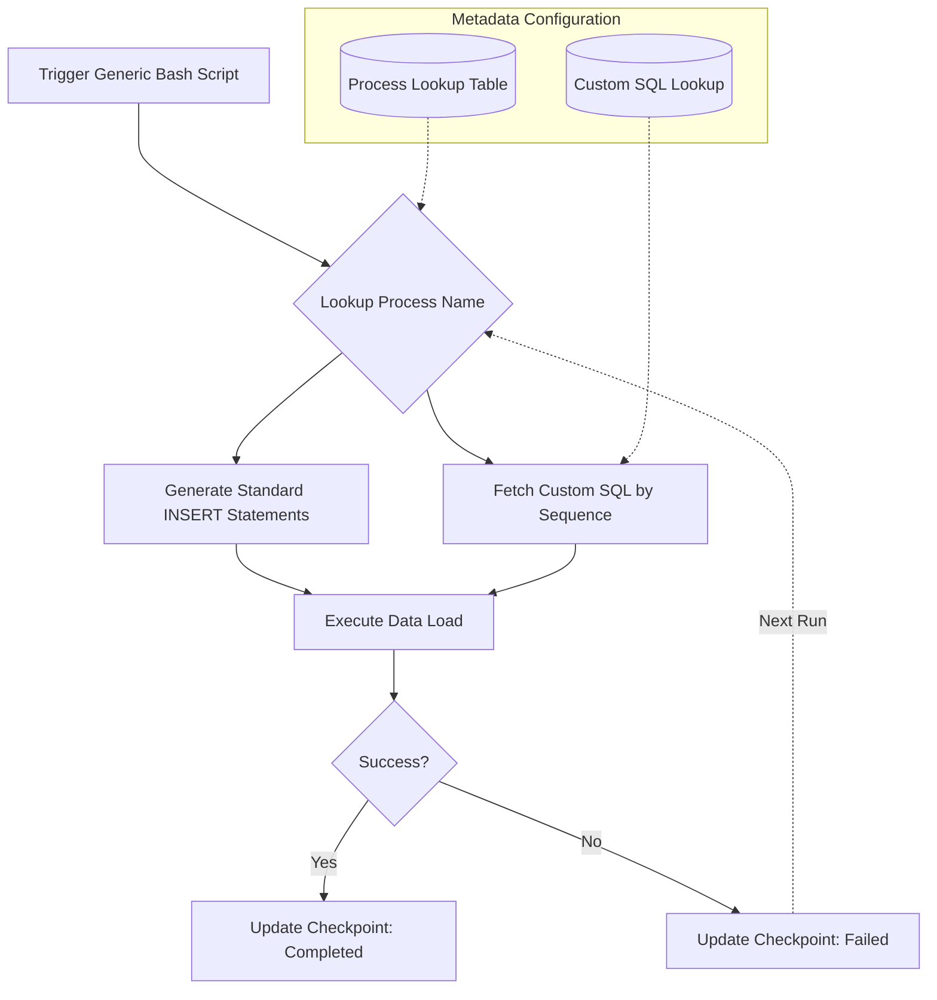

## Impact
100% | Centralized Configuration
0 | Redundant Scripts
100% | Resumable Pipelines

## Overview
While working as a Data Engineer, I noticed a critical bottleneck in our data operations: every new data pipeline required its own custom bash and loading script. Despite following a nearly identical pattern, the lack of standardization meant that any global enhancement to the process required updating hundreds of independent scripts. To solve this, I architected a generic, metadata-driven ETL process.

## The Problem
The team was stuck in a copy-paste development cycle. Without standardized checkpoints, a failure in the middle of a process required extensive manual cleanup and intervention to safely restart the job. Furthermore, custom SQL transformations were scattered, making rollbacks extremely risky and difficult to orchestrate.

### Challenge 1: Code Duplication and Maintenance
**Issue:** The current ETL process followed no standards. The team created individual bash and loading scripts for every process. Enhancing the pipeline meant manually updating every single script across the codebase.
**Solution:** I created a single generic bash script that accepts a process name. By building a metadata lookup table mapping process names to their corresponding stage and enterprise tables, the generic script dynamically generates the necessary INSERT statements on the fly.

### Challenge 2: Managing Custom SQL Transformations
**Issue:** Not all pipelines were simple straight-loads. Custom SQL logic was hardcoded in scattered scripts, making version control and rollbacks practically impossible.
**Solution:** I implemented a centralized SQL lookup table. For custom transformations, we simply added an entry with a sequence number. The generic process executes the SQL in order, meaning logic changes only require a simple table update—making rollbacks trivial.

### Challenge 3: Lack of Fault Tolerance
**Issue:** There were no execution checkpoints. If a multi-hour process failed halfway through, engineers had to manually untangle the state to restart it safely.
**Solution:** I engineered stateful checkpoints into the generic framework so that upon failure, the process knows its exact state and resumes precisely from where it left off automatically.

### Architecture

## Technical Outcomes
- **Metadata-Driven Execution:** Eliminated the need to write new bash scripts for new data feeds. Onboarding a new feed simply requires adding a row to a database table.
- **Automated Recovery:** Checkpoints completely eliminated manual intervention during pipeline failures, saving hundreds of engineering hours.
- **Zero-Downtime Rollbacks:** Storing custom SQL in lookup tables meant that reverting a bad logic deployment was as easy as updating a single row, rather than redeploying bash scripts.
