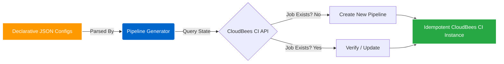

## Impact
250+ | Pipelines Migrated
1 Week | Total Turnaround Time
Awarded | Innovation Champion

## Overview
The client mandated a large-scale migration of all CI/CD workflows from legacy open-source Jenkins to enterprise CloudBees CI. With over 250 complex pipelines to move, relying on a manual click-ops migration strategy would have taken months, introduced massive configuration drift, and risked breaking critical deployment flows. 

## The Problem
Manually re-creating or exporting/importing 250+ jobs is inherently error-prone. We needed a programmatic approach to replicate the pipelines into the new CloudBees environment, verify their state, and ensure that if the migration script failed or was run multiple times, it wouldn't create duplicate or corrupted jobs.

### Challenge 1: Mass Migration at Scale
**Issue:** Migrating 250+ pipelines manually requires massive coordination, downtime, and carries a high risk of human error during configuration translation.
**Solution:** I abstracted all pipeline configurations into declarative JSON files. I then engineered a **Pipeline Generator** script within Jenkins. This generator read the JSON configs as a source of truth and automatically mapped them to the new CloudBees CI environment.

### Challenge 2: Ensuring Safe, Repeatable Executions
**Issue:** If a mass-migration script fails halfway through, determining which jobs were created and which were missed becomes a nightmare. 
**Solution:** I designed the Pipeline Generator to be completely **idempotent**. When executed, it checks the CloudBees API to see if the job already exists. If it does not, it creates it. If it does, it verifies and updates it. This allowed me to safely run the migration script repeatedly without fear of duplication. As a result, I completed the entire migration and verification testing in exactly 1 week, and was awarded the **'Innovation Champion'** award by the client manager.

### Architecture

## Business Outcomes
- **Record-Breaking Speed:** A migration estimated to take weeks or months was flawlessly executed in a single week.
- **Zero Downtime:** The idempotent nature of the sync meant we could run the migration in the background, continuously syncing jobs until the final cutover.
- **Infrastructure as Data:** By representing jobs as JSON, we established a new pattern for easily scaffolding and backing up pipelines moving forward.
