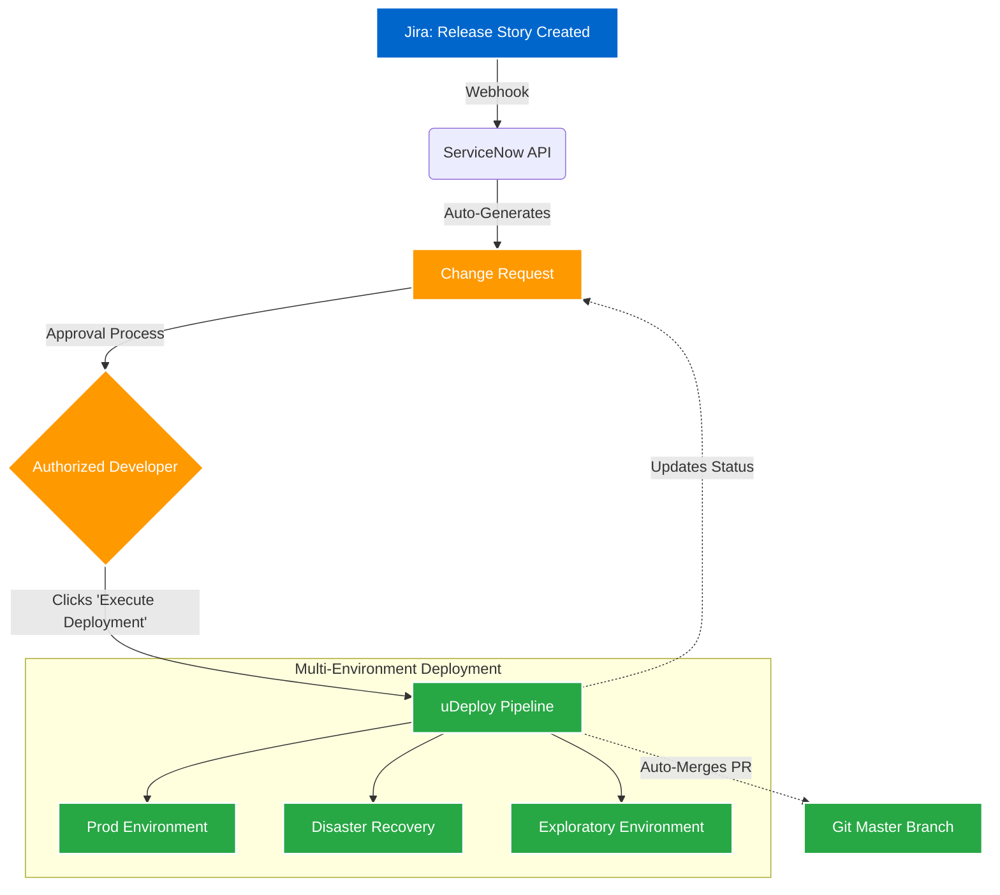

## Impact
100% | Self-Service Deployments
0 | Release Team Bottlenecks
Fully Automated | Change Request (CR) Creation

## Overview
Historically, application development teams were entirely dependent on a centralized release team to deploy their code. This dependency created massive organizational bottlenecks, delayed time-to-market, and generated unnecessary friction between development and operations. To solve this, I designed and implemented a fully automated, Jira-driven self-service release model.

## The Problem
Deploying code required manual coordination, manual ticket creation in ServiceNow, and waiting in a queue for the release team to trigger the actual uDeploy jobs. We needed a secure, compliant way to hand deployment power back to the developers without violating governance policies.

### Challenge 1: The Release Team Bottleneck
**Issue:** Application teams were entirely dependent on a central release team to deploy their code, slowing down release cycles significantly.
**Solution:** I introduced a Jira story-based release model. Now, the application team simply creates a release Jira story, which automatically triggers a ServiceNow API integration to generate the required Change Request (CR) behind the scenes, eliminating manual ticket work.

### Challenge 2: Secure, Automated Execution
**Issue:** Even after a CR was approved, deploying across multiple environments (Prod, DR, Exploratory) and keeping tickets up-to-date was a highly manual, error-prone task.
**Solution:** I built an integration where, once the ServiceNow CR is approved, authorized application developers see an "Execute Deployment" button directly in the ticket. Clicking this triggers uDeploy to automatically roll out the code to Prod, Disaster Recovery, and Exploratory environments. Simultaneously, the process updates the ServiceNow ticket with real-time deployment progress and automatically merges the GitHub Pull Request to the master branch upon success.

### Architecture

## Business Outcomes
- **Zero Bottlenecks:** Developers can now deploy their own code securely and compliantly without waiting on a central release team.
- **Audit & Compliance:** By automating ServiceNow CR creation and status updates, we ensured 100% compliance with ITIL processes without slowing down engineering.
- **End-to-End Automation:** Consolidating Jira, ServiceNow, uDeploy, and Git merges into a single automated flow drastically reduced deployment failures and cognitive load on the teams.
