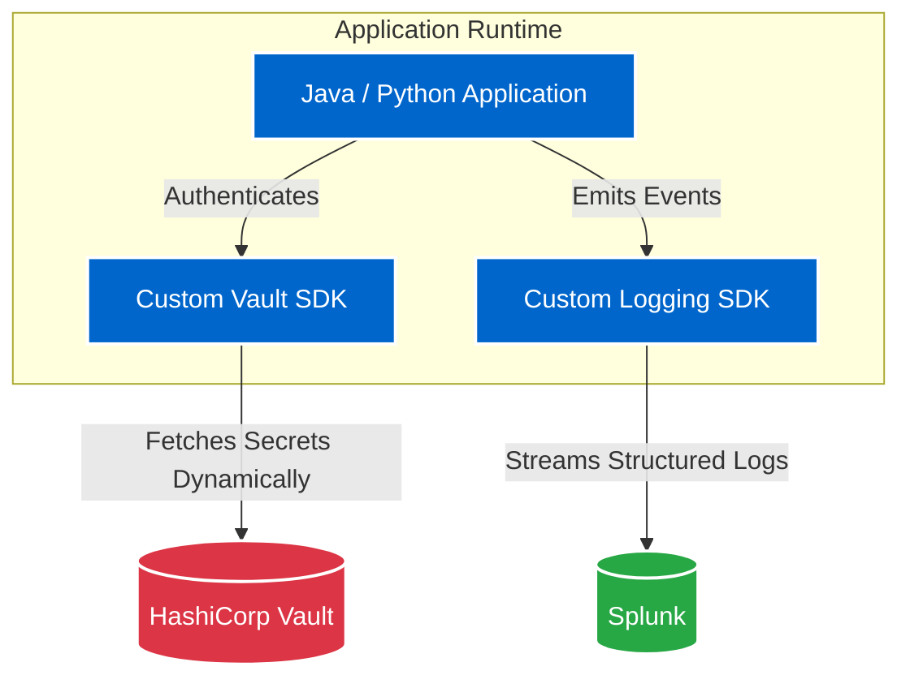

## Impact
100% | Centralized Log Aggregation
Zero | Hardcoded Application Secrets
Instant | Secret Rotation Capability

## Overview
As the business unit scaled its microservices architecture, two major operational risks emerged: debugging was nearly impossible due to fragmented, localized logs, and security was compromised by decentralized, static secret management. I led the initiative to standardize both observability and security across all Python and Java applications.

## The Problem
When a production incident occurred, developers had to SSH into individual servers to grep log files. Furthermore, database credentials and API keys were hardcoded in config files or static JKS files. If a secret expired or was compromised, the team had to trigger a full code recompilation and deployment just to update a password.

### Challenge 1: Lack of Centralized Observability
**Issue:** Application teams had no centralized logging mechanism, making cross-service production debugging extremely difficult and time-consuming.
**Solution:** I engineered robust Python and Java-based logging frameworks that application teams could easily import into their projects. I collaborated closely with the enterprise Splunk team to route and index these structured logs. This transformed debugging from a manual server-by-server hunt into a centralized, highly searchable Splunk dashboard experience.

### Challenge 2: Insecure & Static Secret Management
**Issue:** Storing secrets in configuration files or JKS keystores meant that rotating a secret required a full application redeployment, leading to infrequent rotations and high security risk.
**Solution:** I designed and developed standardized Python and Java integration frameworks for HashiCorp Vault. Instead of reading local configs, applications use my SDK to dynamically fetch secrets at runtime. Secret rotation is now instantaneous, managed centrally in Vault, and entirely decoupled from the application's deployment lifecycle.

### Architecture

## Business Outcomes
- **Decoupled Deployments:** Moving secrets to HashiCorp Vault eliminated the need to redeploy applications just to rotate passwords, massively reducing operational overhead.
- **MTTR Drastically Reduced:** Centralized logging in Splunk allowed developers to trace multi-service transactions instantly, drastically reducing Mean Time To Resolution (MTTR) during incidents.
- **Enterprise Standardization:** Providing ready-to-use SDKs abstracted the complexity of Vault and Splunk integrations, driving 100% adoption across the business unit with minimal friction for developers.
