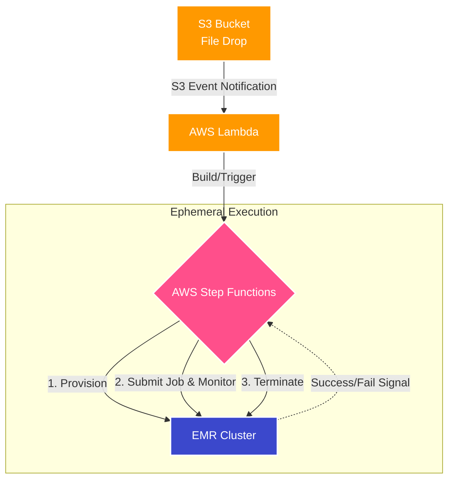

## Impact
100% | Event-Driven
Zero | Idle Compute Waste
Max | Cost Optimization

## Overview
In 2018, before the introduction of EMR Serverless, a client needed to migrate their heavy on-premises ETL flows to the cloud. They wanted to process massive files using AWS EMR clusters. The core requirements were strict: the entire pipeline had to be highly scalable, completely event-driven, and aggressively cost-optimized to ensure they never paid for idle infrastructure.

## The Problem
Running persistent EMR clusters 24/7 for intermittent file processing would have been prohibitively expensive. We needed a way to dynamically provision big data infrastructure exactly when data arrived, route it correctly, and tear everything down the second the job finished. 

### Challenge 1: Cost-Optimized Event-Driven EMR
**Issue:** The client needed to process files in EMR without paying for persistent, idle clusters. Additionally, different file classes required dynamic routing and isolated execution states.
**Solution:** I designed an architecture where files landing in an S3 bucket instantly trigger an AWS Lambda. The Lambda analyzes the file and either builds a new AWS Step Function for that specific file class or triggers an existing one. The Step Function acts as the orchestrator: it spins up an ephemeral EMR cluster, submits the processing job, waits for successful completion, and then immediately destroys the EMR cluster to halt billing.

### Challenge 2: Infrastructure as Code & CI/CD
**Issue:** Manually provisioning Lambda functions, Step Functions, and IAM roles across different environments is error-prone, insecure, and doesn't scale.
**Solution:** I created highly reusable Terraform modules for all the AWS components and set up an automated infrastructure deployment pipeline in GitLab CI/CD, enabling one-click reproducible deployments.

### Architecture

## Business Outcomes
- **Massive Cost Savings:** By enforcing an ephemeral architecture, the client only paid for EMR compute precisely during active processing times.
- **Infinite Scalability:** The S3-to-Lambda trigger meant that sudden bursts of file deliveries were handled automatically and concurrently without manual intervention.
- **Robust Orchestration:** Using Step Functions provided built-in retry mechanisms, state tracking, and visual logging for complex multi-step big data workflows.
