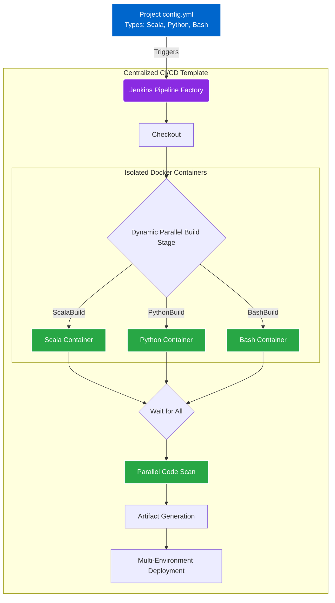

## Impact
100% | Pipeline Duplication Eliminated
Parallel | Multi-Language Builds
Infinite | Scalability across languages

## Overview
As our organization scaled, the lack of a standardized DevOps pipeline for Python, AbInitio, Bash, and Scala projects became a massive bottleneck. The DevOps team was manually creating and maintaining individual `Jenkinsfile` templates for every possible permutation of languages and tool versions, creating an unmanageable matrix of duplicated code.

## The Problem
If a team had a project containing both Scala and Python, the DevOps team had to create a bespoke `Jenkinsfile` just for that combination. Worse, pipelines were hardcoded to specific Maven or Python versions. If a team wanted to upgrade their Python version, they couldn't just change a parameter—they had to be migrated to an entirely different template.

### Challenge 1: Unmanageable Pipeline Duplication
**Issue:** Maintaining hundreds of permutation-specific `Jenkinsfiles` (e.g., Scala+Python, Bash+AbInitio, Maven v3 vs v4) caused widespread duplication and made rolling out global security or deployment updates nearly impossible.
**Solution:** I engineered a "Pipeline Factory" approach. Instead of writing declarative Jenkinsfiles per project, development teams simply pass a deployment type array in a config file (e.g., `['scala', 'python']`). The Factory dynamically generates the pipeline structure at runtime using a centralized, common platform class.

### Challenge 2: Multi-Language Polyglot Execution
**Issue:** Projects often contained multiple languages, but running these builds sequentially on a single Jenkins agent caused dependency collisions and extremely slow CI/CD cycle times.
**Solution:** Within the common platform class, I defined a standard lifecycle: `Checkout -> Build -> Code Scan -> Artifact Generation -> Deployment`. I modified the Build stage to dynamically provision isolated Docker containers for each requested deployment type (e.g., `PythonBuild`, `ScalaBuild`). The Factory loops through the array, executing the builds concurrently in isolation, and automatically joins the state to proceed to the `Code Scan` stage only once all parallel builds succeed.

### Architecture

## Business Outcomes
- **Zero Duplication:** All projects across my business unit now use a single, centralized Jenkins Shared Library. Global updates take minutes instead of months.
- **Future-Proof Upgrades:** Teams can bump their Java, Python, or Maven versions by simply changing a key in their metadata array. The Pipeline Factory automatically pulls the correct Docker container.
- **Faster Build Times:** By isolating execution into language-specific Docker containers running in parallel, complex polyglot projects saw their CI cycle times drop dramatically.
