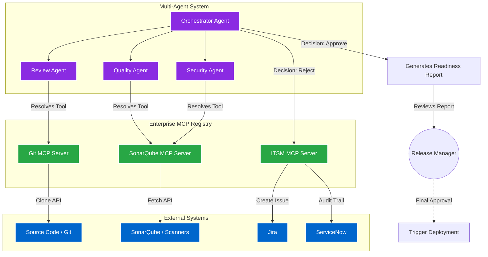

## Impact
Automated | 100% of Release Readiness Checks
Multi-Agent | Coordinated Specialized AI Agents
Integrated | Deep Jira & ServiceNow Automation

## Overview
Release management is traditionally a tedious, manual chore. Release Managers had to painstakingly verify code scans, inspect test coverage, review security vulnerabilities, and ensure compliance before approving a release. I eliminated this friction by engineering an autonomous, multi-agent system that acts as an intelligent Release Manager.

## The Problem

### Challenge 1: Manual Release Readiness Reviews
**Issue:** Assessing whether a branch is ready for release requires checking multiple disparate systems: SonarQube for code coverage, security scanners for vulnerabilities, and manual code reviews for architectural standards. This manual process was a major release bottleneck.

**Solution:** I designed a multi-agent system built on top of the **Agent Development Kit (ADK)** to orchestrate the review pipeline. When a release is requested, the system automatically clones the repository. Specialized ADK sub-agents (e.g., Code Review Agent, Security Agent, Quality Agent) run in parallel to review the codebase, analyze vulnerabilities, and verify test coverage against enterprise standards. 

### Challenge 2: Incident and Ticket Automation
**Issue:** When a release failed readiness checks, managers had to manually document the failures, create Jira tickets for developers, and open ServiceNow incidents for compliance tracking.

**Solution:** I integrated the multi-agent system directly with our ITSM tools using custom **Model Context Protocol (MCP)** servers registered in the ADK. If the collective intelligence of the agents decides a branch is *not* ready for release, the ADK orchestrator autonomously generates detailed Jira tickets assigning specific fixes to the responsible developers, and automatically creates the corresponding ServiceNow audit tickets with full context of the failure.

### Challenge 3: Deployment Governance & Human-in-the-Loop
**Issue:** Fully autonomous deployment by AI poses unacceptable compliance and operational risks. The business required strict human oversight before any code hit production.

**Solution:** I architected the agent to strictly act as an advisor, not an executor. Instead of triggering deployments automatically, the agent generates a comprehensive, informational "Release Readiness Report" summarizing all metrics, identified issues, and its final recommendation. The human Release Manager reviews this report and makes the final, authoritative decision to approve or reject the deployment, maintaining strict AI governance.

## Architecture

- **Orchestrator Agent:** An ADK-powered supervisor agent that delegates tasks to specialized sub-agents.
- **Code Review & Quality Agents:** Specialized ADK agents responsible for cloning the repo, analyzing code coverage, and identifying architectural anti-patterns.
- **Enterprise MCP Servers:** The agents do not communicate directly with external APIs. Instead, they dynamically resolve and utilize isolated MCP tools and servers—registered in the central ADK MCP Registry—which safely broker all communications with external systems (Jira, ServiceNow, SonarQube, Git).

