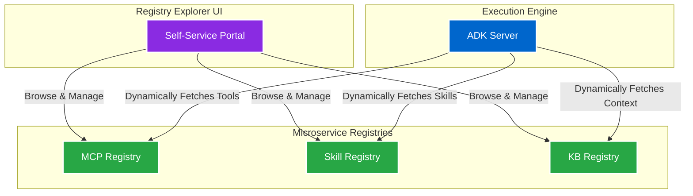
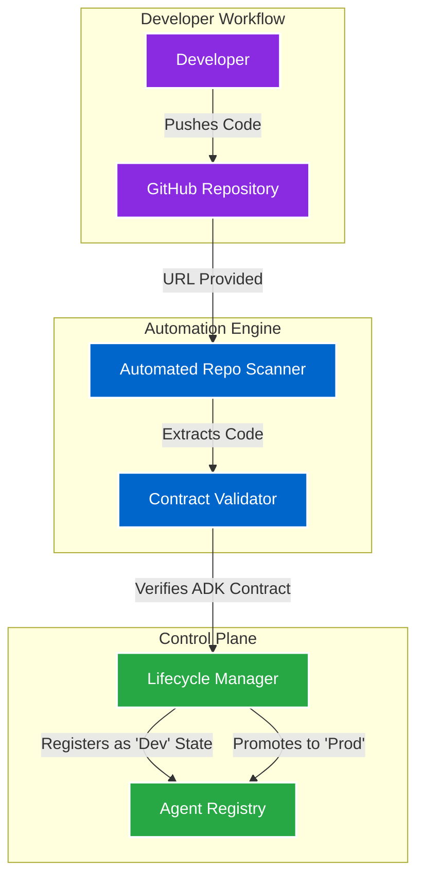
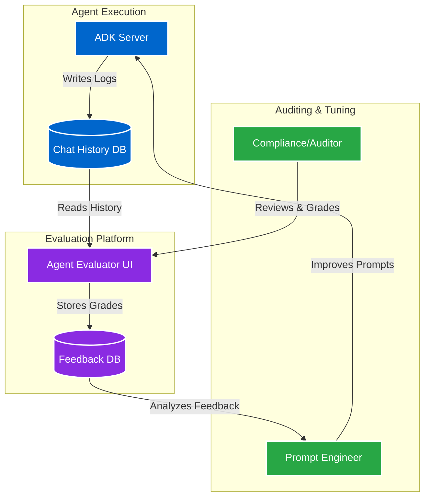
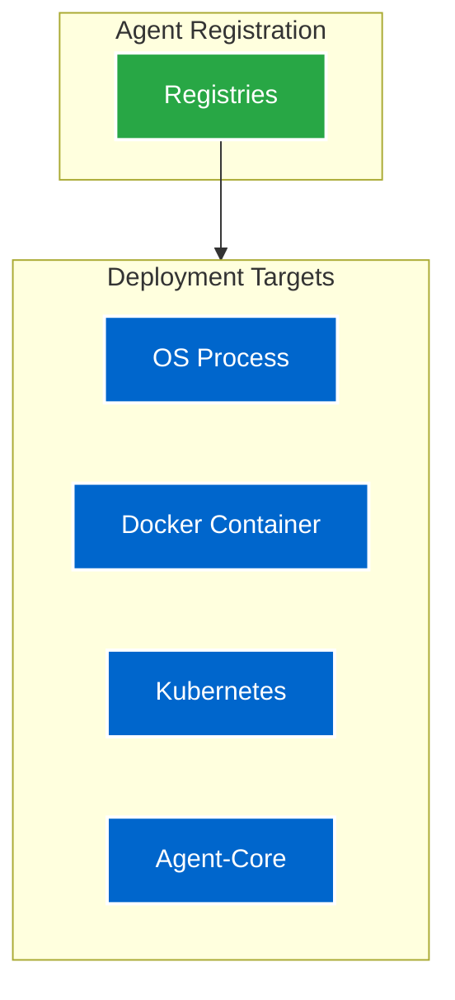

## Overview

As the Enterprise AI Platform evolved, several critical needs emerged regarding tool discovery, agent lifecycle governance, and response auditing. To address these, I developed a series of connected Proof of Concepts (PoCs) that extend the platform's control plane capabilities. These concepts focus on expanding the component registry ecosystem, automating agent onboarding, introducing human-in-the-loop evaluations, and supporting multi-target deployments.

> **Note:** These extensions were conceptualized and designed purely as a Proof of Concept (PoC) idea. 

---

## 1. AI Component Registries

This PoC extended the component registry beyond just agents. It introduced dedicated registries for **Model Context Protocol (MCP) Servers**, **Skills**, and **Knowledge Bases**, enabling developers to share tools and allowing agents to dynamically discover and consume them at runtime.

### Component Types
- **MCP Registry:** Manages Model Context Protocol servers that provide standardized tool integration (e.g., GitHub, Slack, SQL DBs).
- **Skill Registry:** Stores discrete, reusable logic blocks (e.g., Email Parsing, Sentiment Analysis) that agents can invoke.
- **Knowledge Base (KB) Registry:** Indexes and manages document repositories for retrieval-augmented generation (RAG).

### Registry Architecture

### Live Registry Explorer Mockup

  

  

    <button class="registry-tab-btn active" onclick="switchRegistry(event, 'mcps')">🔧 MCP Servers</button>
    <button class="registry-tab-btn" onclick="switchRegistry(event, 'skills')">⚡ Skills</button>
    <button class="registry-tab-btn" onclick="switchRegistry(event, 'kbs')">📚 Knowledge Bases</button>
    <button class="registry-tab-btn" onclick="switchRegistry(event, 'dashboard')">📊 Dashboard</button>
  

  <!-- MCP Servers Tab -->
  

    

      
GitHub Integration

      
Slack Notifications

      
SQL Query

      
Cloud Storage

    

    

      

        

          
GitHub Integration MCP

          
Prod

        

        

          
Endpoints

          
read_repo | list_issues | create_pr | update_status

        

        

          
Used By

          
Code Review Agent, Data Analysis Agent

        

        

          
Test Call

          <input type="text" class="interaction-input" placeholder="e.g., owner/repo">
          <button class="interaction-btn">Call Endpoint</button>
        

      

      

        

          
Slack Notification Server

          
Prod

        

        

          
Endpoints

          
send_message | post_thread | add_reaction | update_status

        

        

          
Used By

          
Customer Support Agent, Email Responder

        

        

          
Test Call

          <input type="text" class="interaction-input" placeholder="Enter message...">
          <button class="interaction-btn">Send Test</button>
        

      

      

        

          
SQL Query MCP

          
Prod

        

        

          
Endpoints

          
execute_query | describe_schema | get_stats | validate_query

        

        

          
Used By

          
Data Analysis Agent, Code Review Agent

        

        

          
Test Call

          <input type="text" class="interaction-input" placeholder="SELECT * FROM...">
          <button class="interaction-btn">Execute</button>
        

      

      

        

          
Cloud Storage MCP

          
Staging

        

        

          
Endpoints

          
upload_file | download_file | list_objects | delete_object

        

        

          
Used By

          
Data Analysis Agent (Staging)

        

        

          
Test Call

          <input type="text" class="interaction-input" placeholder="Enter file path...">
          <button class="interaction-btn">Upload</button>
        

      

    

  

  <!-- Skills Tab -->
  

    

      
Email Parsing

      
Sentiment Analysis

      
Doc Summarizer

      
Code Generator

    

    

      

        

          
Email Parsing Skill

          
v1.2

        

        

          
Description

          
Extracts sender, recipient, subject, body, and attachments from emails

        

        

          
Used By

          
Customer Support Agent, Email Responder

        

        

          
Test Input

          <input type="text" class="interaction-input" placeholder="Paste email content...">
          <button class="interaction-btn">Parse</button>
        

      

      

        

          
Sentiment Analysis

          
v2.0

        

        

          
Description

          
Analyzes text sentiment with confidence scoring (positive, negative, neutral)

        

        

          
Used By

          
Customer Support Agent

        

        

          
Test Input

          <input type="text" class="interaction-input" placeholder="Enter text to analyze...">
          <button class="interaction-btn">Analyze</button>
        

      

      

        

          
Document Summarizer

          
v1.5

        

        

          
Description

          
Generates concise summaries from long-form documents

        

        

          
Used By

          
Data Analysis Agent, Code Review Agent

        

        

          
Test Input

          <input type="text" class="interaction-input" placeholder="Paste document...">
          <button class="interaction-btn">Summarize</button>
        

      

      

        

          
Code Generator

          
v3.1

        

        

          
Description

          
Generates code snippets based on natural language specifications

        

        

          
Used By

          
Code Review Agent (Coming soon)

        

        

          
Test Input

          <input type="text" class="interaction-input" placeholder="Describe what you want to code...">
          <button class="interaction-btn">Generate</button>
        

      

    

  

  <!-- Knowledge Bases Tab -->
  

    

      
Product Docs

      
API Reference

      
Internal Policies

      
Compliance

    

    

      

        

          
Product Documentation

          
2.3K docs

        

        

          
Content

          
User guides, feature documentation, troubleshooting guides

        

        

          
Used By

          
Customer Support Agent, Data Analysis Agent

        

        

          
Search

          <input type="text" class="interaction-input" placeholder="Search documentation...">
          <button class="interaction-btn">Search</button>
        

      

      

        

          
API Reference

          
450 endpoints

        

        

          
Content

          
API specifications, endpoint documentation, authentication guides

        

        

          
Used By

          
Code Review Agent, Data Analysis Agent

        

        

          
Search

          <input type="text" class="interaction-input" placeholder="Search API endpoints...">
          <button class="interaction-btn">Search</button>
        

      

      

        

          
Internal Policies

          
128 docs

        

        

          
Content

          
Company policies, procedures, guidelines, and best practices

        

        

          
Used By

          
Email Responder, Customer Support Agent

        

        

          
Search

          <input type="text" class="interaction-input" placeholder="Search policies...">
          <button class="interaction-btn">Search</button>
        

      

      

        

          
Compliance Guide

          
89 docs

        

        

          
Content

          
Data protection, security standards, audit trails, GDPR compliance

        

        

          
Used By

          
All agents for governance

        

        

          
Search

          <input type="text" class="interaction-input" placeholder="Search compliance docs...">
          <button class="interaction-btn">Search</button>
        

      

    

  

  

    

🔧

4

MCP Servers

    

⚡

4

Skills

    

📚

4

Knowledge Bases

  

  

    
📊 Registry Breakdown

    

      

🔧 MCP Servers

4

3 Prod | 1 Staging

      

⚡ Skills

4

Avg Version: 2.2

      

📚 Knowledge Bases

3.1K

Total Documents

    

  

  

---

## 2. Automated Agent Onboarding & Lifecycle Management

As the volume of agents grew, manually registering and tracking their deployment stages became a bottleneck. This PoC shifted agent onboarding from a manual API process to a frictionless, automated pipeline.

### Key Features
- **Automated GitHub Repository Scanning:** Users provide a repository URL in the UI. The platform automatically scans the codebase, identifies agents based on their adherence to the ADK contract, and automatically registers them.
- **Lifecycle Governance Control:** Introduced a state machine for agents (e.g., Development, Staging, Production). Authorized users can promote or demote agents through various stages, ensuring only vetted agents reach production.

### Onboarding Architecture

---

## 3. Agent Evaluator UI

While automated evaluations are useful, enterprise compliance often requires a human to sign off on an agent's behavior before production promotion. This PoC introduced a human-in-the-loop feedback interface.

### Key Features
- **Human-in-the-Loop Feedback:** The Evaluator UI presented historical chat logs alongside a structured grading rubric. Auditors could rate responses on accuracy, tone, and compliance, flagging problematic interactions. This feedback loop empowered prompt engineers to iteratively improve the agent's prompts.

### Evaluation Architecture

---

## 4. Multi-Target Agent Deployments

While standardizing agent development was a priority, there was also a conceptual need to standardize how agents were deployed to different infrastructure environments. This PoC explored an integration layer where the Agent Registry could push vetted agents to various deployment targets automatically.

### Key Features
- **Environment Agnostic Deployments:** The conceptual architecture supported taking an agent defined by its `agent.yaml` and directly deploying it as an OS Process, a Docker Container, onto a Kubernetes cluster, or into a proprietary Agent-Core environment.
- **Write Once, Run Anywhere:** The goal was to decouple the agent logic from its hosting environment, allowing infrastructure teams to scale agents securely without requiring changes from the AI engineers.

### Deployment Architecture

---

## Business Impact

- **Frictionless Tooling & Adoption:** Automated scanning and dynamic registries reduced the time to publish and discover AI components from hours to seconds.
- **Audit-Ready AI:** Provided compliance teams with the exact governance trail and documentation they required to certify an agent for production use.
- **Continuous Improvement:** Established a data-rich feedback loop enabling prompt engineers to refine agent performance based on real human critiques.
