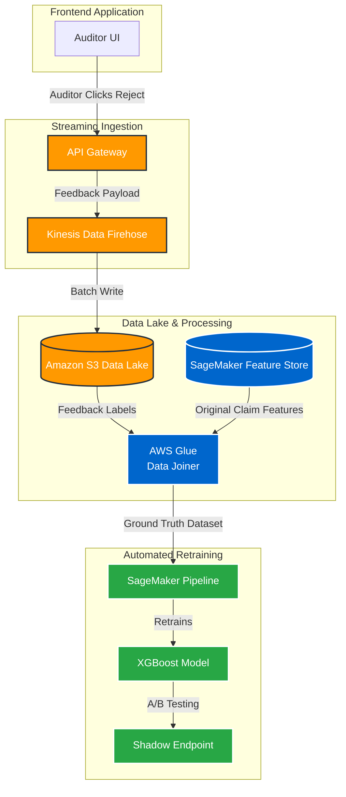
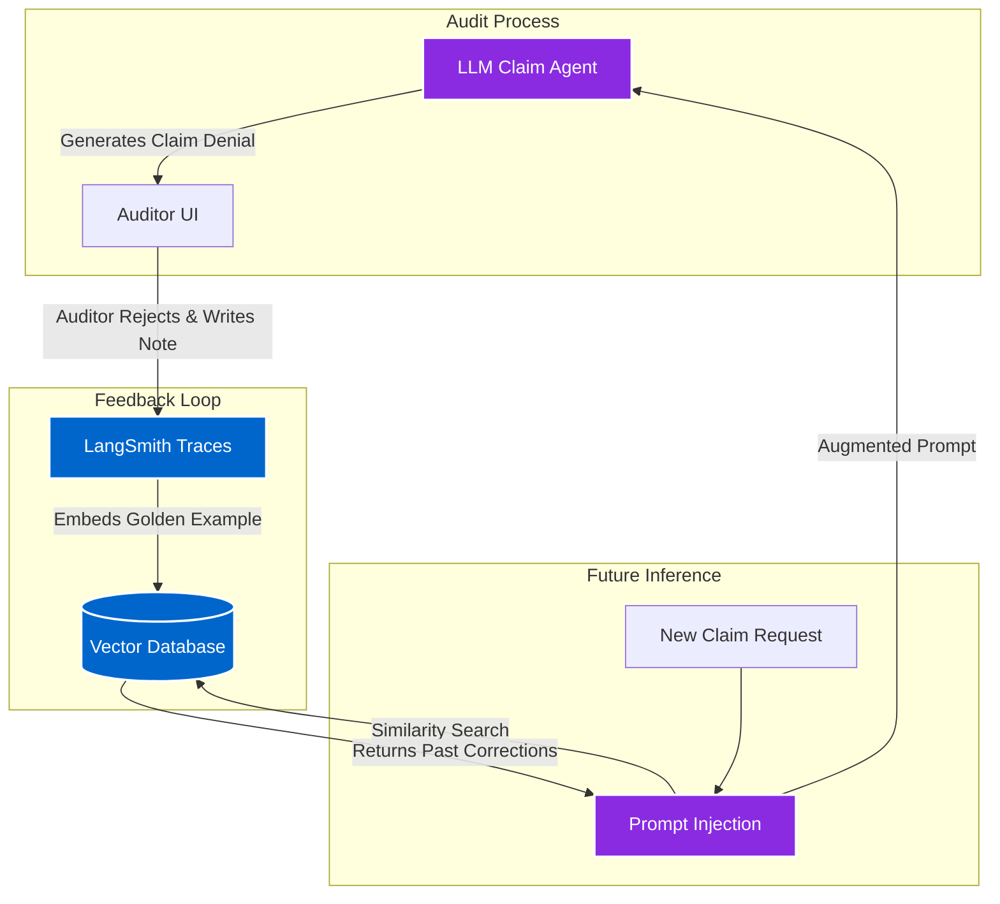

## The Challenge

In mission-critical environments like CMS (Medicare/Medicaid) commercial auditing, AI systems are deployed to flag erroneous or fraudulent medical claims. However, AI is not perfect. When an AI denies a claim and a human Clinical Auditor reviews it, they may disagree with the AI's decision. 

**The architectural challenge:** How do we seamlessly capture the auditor's "Accept/Reject" signal and use it to automatically retrain or guide the AI so that it never makes the same mistake twice? 

Below are two architectural approaches to solve this, depending on the nature of the AI system.

---

### Approach 1: Traditional ML (Continuous Training)

For predictive anomaly scoring (e.g., an XGBoost model scoring a claim's fraud probability based on structured billing codes), the system relies on a **Continuous Training (CT)** pipeline to mathematically adjust the model's weights.

**Implementation Details:**
1. **Event Capture:** When an auditor rejects an AI score, a payload containing the `ClaimID`, `ModelVersion`, and `Label=0` is streamed via Kinesis.
2. **Feature Joining:** A scheduled Glue job joins this new label with the original input features stored in the SageMaker Feature Store.
3. **Automated Pipeline:** A SageMaker Pipeline triggers weekly, retrains the model on the updated Ground Truth dataset, and deploys it to a Shadow Endpoint to ensure precision/recall improvements.

---

### Approach 2: Agentic AI (Dynamic In-Context Learning)

For Generative AI systems (e.g., an LLM Agent reading a 50-page unstructured medical chart and a CMS policy document), continuous retraining of a Foundation Model is prohibitively expensive. Instead, we use **Dynamic In-Context Learning** to give the Agent "memory" of past auditor corrections.

**Implementation Details:**
1. **Correction Capture:** The auditor rejects the AI's explanation and writes: *"The AI missed the addendum on page 12 stating the patient had a comorbidity."*
2. **Vector Storage:** This correction is embedded and stored in a Vector DB as a "Negative Example".
3. **Dynamic Prompting:** The next time the Agent evaluates a similar claim, it queries the Vector DB and dynamically injects the auditor's past feedback into its system prompt: *"Warning: In a previous audit, you missed comorbidities in the addendums. Ensure you scan all addendums."*

## Business Outcomes
- **Zero-Friction Alignment:** The AI system aligns with clinical auditor reasoning instantly (via Agentic prompts) or continuously (via ML pipelines) without requiring manual data science intervention.
- **Reduced Hallucinations:** By injecting past human corrections directly into the LLM context, the system is prevented from repeating the exact same audit mistakes.
- **Enterprise Governance:** The architecture provides a full audit trail of how and why a model evolved, ensuring compliance with strict healthcare and CMS data governance policies.
