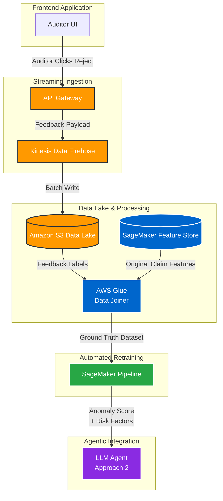
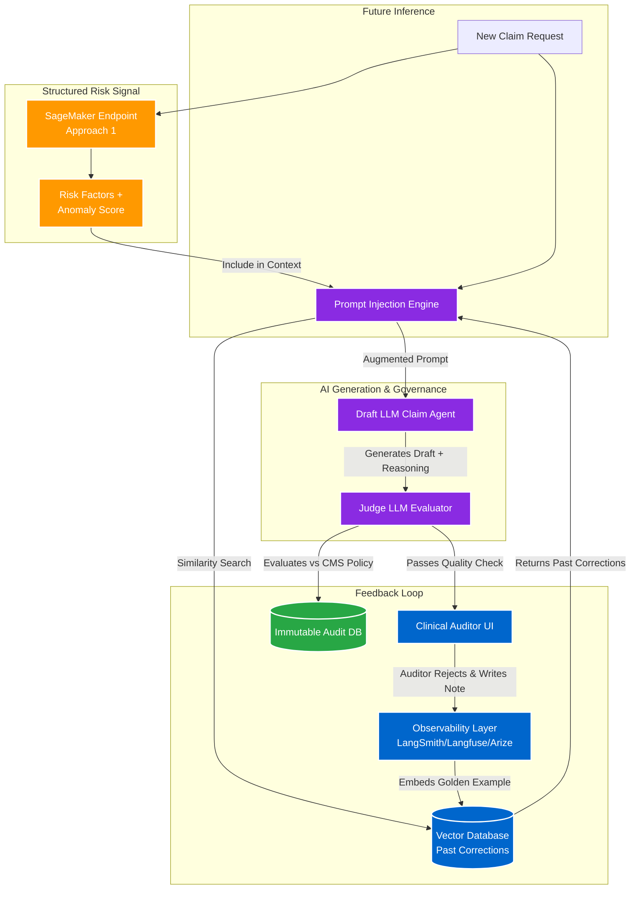

## The Problem

You have an AI system that flags suspicious medical claims. But sometimes the AI is wrong. When an auditor disagrees with it, you need to:
1. Learn from that mistake right away (don't flag similar claims the same way)
2. Make the overall model better so it catches the real fraudulent claims

How do you set up the system so that auditor feedback automatically improves the AI without manual data science work every time? 

Here are two ways to solve this, depending on what kind of AI you're using.

---

### Approach 1: Traditional ML (Weekly Model Retraining)

Use model to score claims based on billing codes and claim history. When auditors reject predictions, we automatically retrain the model weekly with this new feedback. The updated model is deployed as an API endpoint that the LLM agent can call to get numerical risk scores.

**How it works:**
1. **Capture feedback:** When an auditor rejects a prediction, send the claim ID, features, and rejection reason to a data pipeline.
2. **Store and join data:** Combine the rejection with the original claim features in a database.
3. **Retrain weekly:** Run a job that takes all the new rejections + features and retrains the model. Test it against the old model to make sure it's actually better before deploying.
4. **Expose as an API:** Deploy the new model so the LLM agent can call it. When processing a claim, the agent asks: "What does the ML model think about this claim?" and gets back a risk score plus a list of red flags (e.g., billing code mismatch, unusual claim amount).
5. **Combined reasoning:** The agent uses both the ML score and the medical chart to make a decision. For example: "The model says fraud risk is 82%, and I see the claim amount is double the patient's usual claims. Together, this looks suspicious."

---

### Approach 2: LLM Agent with Memory (Vector Database + ML Signals)

An LLM agent reads through medical charts and policy documents to decide on claims. Since retraining large language models is expensive, we give the agent two types of memory instead:
- **Short-term:** Past auditor corrections stored in a vector database. When a similar claim comes in, we remind the agent: "Last time, you missed X. Make sure to check Y this time."
- **Medium-term:** The ML model endpoint from Approach 1, giving numerical risk scores to guide the decision.

**How it works:**
1. **Get ready to decide:** When a new claim comes in:
   - Call the ML model endpoint to get a risk score
   - Search the vector database for similar past cases where an auditor corrected us
   - Tell the agent: "Here's what the model says (fraud risk 82%). Here's what we learned last time: don't miss comorbidities in addendums."
2. **Agent decides:** The agent reads the medical chart, considers the ML score, thinks about past mistakes, and writes its reasoning to a judge.
3. **Judge reviews:** A second LLM (the judge) checks the agent's work against CMS policy and either approves it or sends it to a human.
4. **Auditor feedback:** If a human disagrees with the agent, they write a note explaining the discrepancy.
5. **Learning happens twice:**
   - **Immediately:** That correction gets stored in the vector database. The next similar claim triggers the reminder.
   - **Weekly:** The same correction also goes to the ML model retraining pipeline, making next week's model smarter.

## Key Rules for CMS Compliance

Since this is healthcare and highly regulated, the system has a few hard rules:

- **Show your work:** Every decision needs to explain *why*. The agent shows which policy rule it used, which part of the chart it read, and what the model flagged.
- **Confidence threshold:** If the agent is less than 95% sure, it asks a human instead of deciding alone. No guessing on high-stakes decisions.
- **Humans decide:** Auditors always have final say. The AI learns from their corrections—that's how it improves. If we stop listening to feedback, the AI will drift and make worse mistakes over time.
- **Keep records:** Everything gets logged—the agent's reasoning, the model's scores, what the judge said, what the auditor did. This is for compliance audits and to track whether the AI is actually getting better.

## What This Gets You

- **Learns fast and keeps learning:** Auditor feedback helps the agent immediately (next claim) and also retrains the ML model (next week). So the system gets better right away and also builds long-term improvements.
- **Fewer mistakes, catches more patterns:** The agent gets two hints for each claim: "The ML model flagged this as risky" and "Last time we had a similar case, we missed X." This prevents repeating the same mistake.
- **You can explain why:** When the agent makes a decision, you know exactly why—what part of the chart it read, what the model said, which policy rule it used. Not a black box.
- **Stays compliant:** The auditor is always in control. The system learns from them, everything is logged, and you can prove to regulators that the AI is actually getting better (or catch it if it's getting worse).
